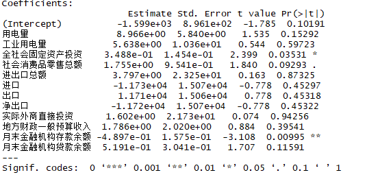

# Machine_Learning_Example
博士分享的一些机器学习算法的应用  自己又改善了一下  加了一些图和注释


### ————————————机器学习——————————————————  
#### 一元回归 
 ```r
setwd("E:/RCode/MLT/")  
setwd("E:\\RCode\\MLT\\")  
#设置路径，注意“\”和“/”、“\\”的区别  
#R语言中路径需使用“/”或“\\”，不使用“\”

md=read.csv("MacroData.csv")
#读取数据，
#第一行为字段名 head=T，默认。如果第一行为数据，使用 head=F。

smd=md[,c(1,2,5)]
#提取两列数据做一元回归
#自变量：全社会固定资产投资；因变量：GDP

head(smd)
#观察数据，默认显示表头和6行数据，
#可采用 head(smd,10)的形式显示不同行数

summary(smd)
#显示各列数据的分布情况
str(smd)
#显示数据的类型和示例数据

sum(is.na(smd$GDP))
sum(is.na(smd[,2]))#查看第二列的缺失值
sum(is.na(smd[1,]))#查看第一行的缺失值
#单变量、单行查询缺失值
#R中使用数据表某一列时，使用“$”，
#也可以使用“[,]”的形式，“,”前行后列

sapply(md,function(x) sum(is.na(x)))
#多变量查询缺失值
#本例数据没有缺失值

plot(smd[,c(3,2)])
#画出散布图（散点图）
#在c(,)中，自变量放在逗号前面，因变量放在逗号后面

cor(smd$GDP,smd$全社会固定资产投资)
##检查相关性

fit1=lm(smd$GDP~smd$全社会固定资产投资)
#建立一元回归模型

fit1
#得出回归方程
#(intercept)项为截距，后边为自变量系数

summary(fit1)
```
#### 模型详细说明  
#### Call项下为方程  
#### Residuals项下为残差分布  
#### Coefficients项下为系数  
#### Signif.codes项下为显著程度，一般要求：    ----显著程度有什么用  
#### “***”、“**”、“*”和“.”，即0.05以下    
#### Adjusted R-squared项下为调整R方，越接近“1”拟合越好。  
#### F-statistic项下为F值，一般看其右侧的p-value，最好小于0.05  
#### 注意：Coefficients项下有一个Pr(>|t|)，是该变量的t检验的P值，  
#### 与p-value的值相同，在单变量回归中，二者等效。  
</img>


### 检查误差情况
```r
library(xxIRT)
RMSE=rmse(smd$GDP,fit1$fitted.values)
MSE=(rmse(smd$GDP,fit1$fitted.values))^2
MAE=sum(abs(smd$GDP-fit1$fitted.values))/nrow(smd)
RMSE
MSE
MAE

abline(fit1)
#在散点图中加入拟合直线

plot(predict(fit1,interval = "prediction",level = 0.95))

plot(fit1$residuals)
#残差散点图

shapiro.test(fit1$residuals)
#残差正态性检验，p-value大于0.05说明残差服从正态分布，可以接受

x=smd$全社会固定资产投资
y=smd$GDP
fit2=lm(y~x)
aa=predict(fit2,data.frame(x=c(9000,10000)),level = 0.95,interval="prediction")
aa
```
#### 进行预测，并把预测值赋给“aa”
#### "level"置信度
#### "prediction"给出指定level下的因变量的点值的预测区间（常用）
#### "confidence"给出指定level下的因变量的均值置信区间（不常用），
#### 此例并不适用均值预测，因为只预测了一个值，如果预测多个值，可以参考使用。


### ————————————机器学习——————————————————
#### 多元回归

```r
setwd("E:/RCode/MLT/")
md=read.csv("MacroData.csv",head=T)

head(md)

GDP=md[,2]
ZBL=md[,3:14]
#为使用方便，这里将md数据集拆分为GDP和ZBL（自变量）。

plot(GDP,ZBL[,4],ylab="GDP",xlab=colnames(ZBL)[4])
#逐幅观察GDP与ZBL中每个字段的散点图

pairs(md[,2:13])
#pairs(md[,2:13],upper.panel = NULL) 只显示下半部分
```
</img>


#### 一次性显示全部字段两两之间散点图。
#### md[,2:13]表示md表的第2列到第13列
```r
cc=cor(GDP,ZBL)
cc
#测算GDP与ZBL中所有列的相关系数。

g=cor(ZBL[,1:ncol(ZBL)],use="complete.obs")
g
#这种形式是测算一个表（ZBL）中所有字段两两之间的相关性。
#ZBL[,1:ncol(ZBL)]表示ZBL表中从第1列到最后一列。

corrplot(cor(md[,-1], use="complete.obs"),type="lower")
```
</img>
```r
f1=lm(GDP~.,ZBL)
#其中，“GDP”代表因变量，其后的“~”表示关系，其后的“.”表示利用后边表的所有字段。
#如果只是用ZBL中的某个字段，可以使用“GDP~ZBL[,1]+ZBL[,2]”的形式。

f1
summary(f1)
#根据结果可以看出，变量对应Pr(>|t|)的值，带有“*”和“.”的很少，
#虽然Adjusted R-squared的值为0.98，也不能说这个模型就是一个好模型。
#需要进一步处理。一般采用变量删减和共线性检验来处理变量。
```
</img>

```r
library(car)
vif(f1)
#先看看共线性，多数指标的VIF值都超过10，有些还很大，说明共线性的情况比较严重。
#共线性:多个变量可能高相关，造成了模型方程的不稳定
#可以采取逐步回归的方法，或者Lasso、偏最小二乘回归或者岭回归（后三种处理手法略）。

f2=step(f1,direction="both")
#可以看出AIC值在各步之间的变动，最终的模型AIC值最小。
f2
summary(f2)
#双向逐步回归，变量的Pr值有所好转，还有进口、出口、净出口三个变量有问题。
```
</img>
```r
vif(f2)
#后五个指标的VIF值超标。

f3=step(f1,direction="forward")
f3
summary(f3)
#此处并无明显变化，因为f1模型已经将所有变量纳入了，无法再增加变量。
```
</img>
```r
f4=step(f1,direction="backward")
#与f2模型得到的结果一致。
f4
summary(f4)

kappa(f1)
#kappa命令也可以进行多重共线性检验，与VIF等效。

f5=lm(GDP~ZBL$用电量+ZBL$全社会固定资产投资+ZBL$社会消费品零售总额+ZBL$进口+ZBL$出口+ZBL$净出口+ZBL$月末金融机构存款余额+ZBL$月末金融机构贷款余额)
f5
summary(f5)
#经过逐步回归，我们可以得到f5模型，但是共线性的情况依然存在。
#进口、出口、净出口之间存在线性关系。通常采用净出口。

f6=lm(GDP~ZBL$用电量+ZBL$全社会固定资产投资+ZBL$社会消费品零售总额+ZBL$净出口+ZBL$月末金融机构存款余额+ZBL$月末金融机构贷款余额)
f6
vif(f6)
summary(f6)
#结果显示月末金融机构贷款余额Pr值过大，删除这个变量（与存款余额存在共线性）。

f7=lm(GDP~ZBL$用电量+ZBL$全社会固定资产投资+ZBL$社会消费品零售总额+ZBL$净出口+ZBL$月末金融机构存款余额)
f7
vif(f7)
summary(f7)
```
#### 虽然还有两个指标的VIF值大于10，但仅仅是略超，可以容忍。
#### 检验：
#### t-P值（Pr值）都小于0.05，没问题；
#### F-P值< 2.2e-16，没问题；
#### Multiple R-squared:  0.9886和Adjusted R-squared:  0.9855非常大，OK；
#### AIC值较小（并非最小），最小的状态出现共线性，二者相比，共线性的危害比较大，
#### 首先满足共线性的检验，再考虑AIC值。

```r
library(xxIRT)
RMSE=rmse(md$GDP,f7$fitted.values)
MSE=(rmse(md$GDP,f7$fitted.values))^2
MAE=sum(abs(md$GDP-f7$fitted.values))/nrow(md)
RMSE
MSE
MAE

plot(predict(f7,interval = "prediction",level = 0.95))

plot(f7$residuals)
#残差散点图

shapiro.test(f7$residuals)
#残差正态性检验，p-value大于0.05说明残差服从正态分布，可以接受

x=md[,c(3,5,6,10,13)]
newx=data.frame(用电量=500,全社会固定资产投资=8500,社会消费品零售总额=4000,净出口=250,月末金融机构存款余额=42000)
y=md$GDP
f8=lm(y~.,data=x)
bb=predict(f8,newx,level = 0.95,interval = "confidence")
bb
```
#### 进行预测，并把预测值赋给“bb”
#### "level" 给出置信度
#### "prediction"给出指定level下的因变量的点值的预测区间（常用）
#### "confidence"给出指定level下的因变量的均值置信区间（不常用）
#### 此例并不适用均值预测，因为只预测了一个值，如果预测多个值，可以参考使用。


### ————————————机器学习——————————————————
#### K-means
#### package: stats（自带）  命令：kmeans();
```r
data(iris)
data_aa=iris
#读入数据后，最好将原始数据另存一个名字，
#一旦出现误操作，不至于重新读入数据，特别是数据量较大的时候。
head(data_aa)

data_bb=data_aa
data_bb$Species=as.numeric(factor(data_bb$Species))
#kmeans聚类的结果为1、2、3……，为了直观，将Species分类也改为数值，
#当然也可以不用改。

km_model=kmeans(data_bb[,1:4], centers=3, iter.max = 100)
#centers为聚类的个数，本例中iris的species有三类，因此设置centers=3
#如果未知分类个数，需要进行centers值的测试；
#iter.max 最大迭代次数，根据数据量设置，数据量小，20、30次就够了，
#如果字段、数据量大，可能需要100、1000次。也可以根据warning message 进行调整。

km_model$cluster
#给出聚类结果，一串1、2、3……
data_cluster=cbind(data_aa,cluster=km_model$cluster)
data_cluster
#将聚类结果添加到原数据表。
#同时重命名km_model$cluster。

table(as.numeric(factor(data_bb$Species)),km_model$cluster)
#做出混淆矩阵，看看聚类精度，不常用的做法。
#相当于将kmeans的聚类结果与原始类别结果进行比较，
#但通常的数据不会有原始类别结果，无法进行这一步的比较。
#到“data_cluster=cbind(data_aa,km_model$cluster)”即可。

##以下对聚类结果进行检验，
#PPT上写了CP、SP、DB等，可以自行测试。
#比较直观、易于理解（但不正规）的方法是：
#根据聚类结果看各个类别的各个字段的均值、方差等指标，是否具有明确的区分度。
#例如均值检验、方差分析等。

km_sp=split(data_cluster,data_cluster[,6])
km_sp
#将data_cluster按照cluster进行分组，便于后边分组比较。


km_test_1=t.test(km_sp$`1`[,1],km_sp$`2`[,1])
km_test_2=t.test(km_sp$`2`[,1],km_sp$`3`[,1])
km_test_3=t.test(km_sp$`3`[,1],km_sp$`1`[,1])
#两两检验分组之间相同字段的均值是否相同，
#这里面仅检验了[,1] "Sepal.Length"字段，其他字段可以自行检验。

km_mean_test=cbind(km_test_1$p.value,km_test_2$p.value,km_test_3$p.value)
km_mean_test
#汇总检验结果，并观察
#可以看出，p.value都非常小，说明：拒绝“两组之间均值无差异”的原假设 犯错误的概率很小。
#可以认为“两组之间均值有差异”。

##另一种不用检验的方式（更加不正规）但比较快。
#直接观察各组的各种（如均值、方差等的）值。
mean_1=lapply(km_sp,FUN = function(x) mean(x[,1]))
mean_2=lapply(km_sp,FUN = function(x) mean(x[,2]))
mean_3=lapply(km_sp,FUN = function(x) mean(x[,3]))
mean_4=lapply(km_sp,FUN = function(x) mean(x[,4]))
#mean()可以修改为sum(),var(),sd()等。

mean_all=cbind(SL_mean=mean_1,SW_mean=mean_2,
               PL_mena=mean_3,PW_mean=mean_4)
#合并所有结果

mean_all
#观察各字段分组均值结果
```


### ————————————机器学习——————————————————
#### K近邻
#### pakcage: class  命令：knn(); kknn  命令：kknn();

```r
data(iris)
data_aa=iris

index=1:nrow(data_aa)
#建立一个标签，便于制作训练集和测试集

testindex = sample(index, trunc(length(index)/3))
#随机抽选标签中的1/3，

trainset=data_aa[-testindex,]
#建立训练集，上步选中1/3之外的标签

testset=data_aa[testindex,]
#建立测试集，上上步中1/3标签

summary(trainset$Species)
summary(testset$Species)
#观察训练集和测试集拆分是否合适。一般要求测试集各个类别的比例与训练集各个类别的比例差不多。

library(kknn)
knn.model_1=kknn(Species~., trainset, testset, k=15, 
                 distance = 1, kernel = "optimal", 
                 scale = FALSE)

knn.model_2=kknn(Species~., trainset, testset, k=15, 
                 distance = 2, kernel = "optimal", 
                 scale = FALSE)

knn.model_3=kknn(Species~., trainset, testset, k=15, 
                 distance = 3, kernel = "optimal", 
                 scale = FALSE)

#上述模型中，只调整了distance参数，还可以对kernel参数进行调整。

fit.knn_1=fitted(knn.model_1)
fit.knn_2=fitted(knn.model_2)
fit.knn_3=fitted(knn.model_3)
#提取三个模型的判别值

table(testset$Species,fit.knn_1)
table(testset$Species,fit.knn_2)
table(testset$Species,fit.knn_3)
#观察三个模型的判别混淆矩阵。

library(pROC)
multiclass.roc(as.numeric(factor(testset$Species)),
               as.numeric(factor(fit.knn_1)), plot=TRUE)
#这个命令要求分类标签必须为数值型。

multiclass.roc(as.numeric(factor(testset$Species)),
               as.numeric(factor(fit.knn_2)), plot=TRUE)

multiclass.roc(as.numeric(factor(testset$Species)),
               as.numeric(factor(fit.knn_3)), plot=TRUE)


#####扩展：
#以下利用train.kknn()命令，自动寻找最佳k值和kernel参数。
trial_kknn <- train.kknn(Species ~ ., data = data_aa, distance = 2,
                         kmax = 15, kernel = c("rectangular", "triangular", "epanechnikov",
                                               "gaussian", "rank", "optimal"))
#distance 可以设定不同数值

plot(trial_kknn)
#画出各种参数下判别错误情况

trial_kknn$best.parameters
#给出最优的kernel参数和k值

knn.model_best_1=kknn(Species~., trainset, testset, k=9, 
                      distance = 2, kernel = "rectangular", 
                      scale = FALSE)
#用最优kernel参数和k值建模

fit.knn_best_1=fitted(knn.model_best_1)
#给出测试集判别结果

table(testset$Species,fit.knn_best_1)
#给出测试集判别混淆矩阵
```


### ————————————机器学习——————————————————
#### 层次聚类
#### pakcage: stats(自带)  命令：hclust();

```r
data(iris)
data_aa=iris

data_dd=dist(scale(data_aa[,1:4]))
#对分层聚类所需字段，求出各样本之间的距离。

hc_model=hclust(data_dd,method = "complete")
#method可以设置为
#single       最短距离法
#complete     最长距离法
#median       中间距离法
#mcquitty     相似法
#average      类平均法
#centroid     重心法
#ward.D       离差平方和法
#ward.D2
#效果自行测试。

plot(hc_model,hang = 0.1)
#画出层次聚类图。

hc_result=cutree(hc_model,3)
#对层次聚类结果进行切割，以得到所定的问分类，这里选择3类。

hc_result
#观察各类别结果

data_hc=cbind(data_aa,cluster=hc_result)
data_hc
#将层次聚类结果添加到原数据表。
#同时重命名hc_result。

table(as.numeric(factor(data_aa$Species)),hc_result)
#做出混淆矩阵，看看聚类精度，不常用的做法。
#相当于将层次聚类结果与原始类别结果进行比较，
#但通常的数据不会有原始类别结果，无法进行这一步的比较。
#到“data_hc=cbind(data_aa,cluster=hc_result)”即可。

##以下会对聚类结果进行检验，
#PPT上写了CP、SP、DB等，可以自行测试。
#比较直观、易于理解（但不正规）的方法是：
#根据聚类结果看各个类别的各个字段的均值、方差等指标，是否具有明确的区分度。
#例如均值检验、方差分析等。

hc_sp=split(data_hc,data_hc[,6])
hc_sp
#将data_cluster按照cluster进行分组，便于后边分组比较。


hc_test_1=t.test(hc_sp$`1`[,1],hc_sp$`2`[,1])
hc_test_2=t.test(hc_sp$`2`[,1],hc_sp$`3`[,1])
hc_test_3=t.test(hc_sp$`3`[,1],hc_sp$`1`[,1])
#两两检验分组之间相同字段的均值是否相同，
#这里面仅检验了[,1] "Sepal.Length"字段，其他字段可以自行检验。

hc_mean_test=cbind(hc_test_1$p.value,hc_test_2$p.value,hc_test_3$p.value)
hc_mean_test
#汇总检验结果，并观察
#可以看出，p.value都非常小，说明：拒绝“两组之间均值无差异”的原假设 犯错误的概率很小。
#可以认为“两组之间均值有差异”。

##另一种不用检验的方式（更加不正规）但比较快。
#直接观察各组的各种（如均值、方差等的）值。
hc_mean_1=lapply(hc_sp,FUN = function(x) mean(x[,1]))
hc_mean_2=lapply(hc_sp,FUN = function(x) mean(x[,2]))
hc_mean_3=lapply(hc_sp,FUN = function(x) mean(x[,3]))
hc_mean_4=lapply(hc_sp,FUN = function(x) mean(x[,4]))
#mean()可以修改为sum(),var(),sd()等。

hc_mean_all=cbind(SL_mean=hc_mean_1,SW_mean=hc_mean_2,
                  PL_mena=hc_mean_3,PW_mean=hc_mean_4)
#合并所有结果

hc_mean_all
#观察结果
```
####扩展：
#利用NbClust包的NBClust()命令，寻找最优分类数量。
library(NbClust)
hc_nc = NbClust(scale(data_aa[,1:4]),distance = "euclidean",
                min.nc = 2,max.nc = 15,method = "complete")

#参数：  
#距离方法为欧几里德，distance = "euclidean"  
#也可以使用其他距离方法，参照帮助文件。  
#最小分类为2，最大分类为15，在2-15类之间找出最优分类  
#method用法同上。  
##结果：  
#出4个图，并不是最重要。  
#最重要的是，给出的一堆说明的最下方  
#有个“*Conclusion*”项，其下方会说明最优分类是 ?  
#本例中给出的最优分类是“3”  

table(hc_nc$Best.nc[1,])  
#这个是将2-15个分类的推荐数量列出来，哪个数字的推荐数量越多，就是越好的分类。  
#本例中3分类对应17个推荐，视为最优  。


